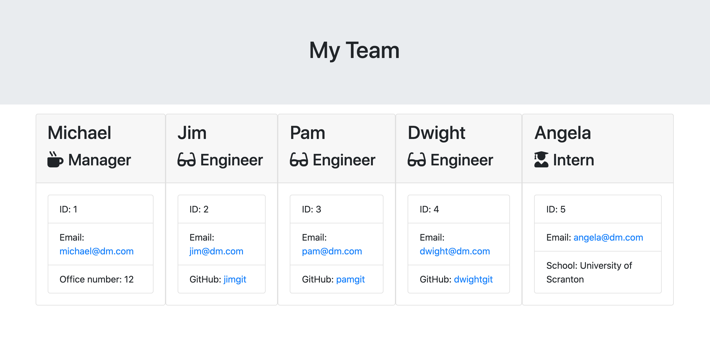

# Engineering Team Generator

## Description
The Engineering Team Generator is a command line application that allows users to create a HTML webpage to display a team summary. Users are prompted for information about employees through Inquirer in command line. HTML is then dynamically created based on the user inputs to create a webpage. Managers can easily generate a webpage overview of their team for quick access to emails and GitHub profiles. 

## Installation
This program utilizes the Inquirer and Jest packages. To install necessary dependencies, run the following in command line:

    npm install

## Usage
1. Install necessary dependencies through the command "npm install"
2. Initiate the generator with the command "node app.js"
3. Respond to the questions that are prompted in command line
4. Once all prompts are finished a team.html file will be created in the output folder
5. Open the file in the browser of your choice

## Features
* Test driven development approach
    * Classes and subclasses were first tested using Jest and then created/updated to pass testing
    * Test driven development helps to create cleaner code which is easier to understand
* Inquirer prompts users for inputs
    * Users are prompted in command line and their inputs are stored in objects which are used to dynamically create the HTML webpage
* Classes and subclasses for team member objects
    * A class was created for employees
    * Managers, engineers, and interns are all subclasses which inherit properties from the employee class

## Built With
* [Jest](https://jestjs.io/en/) - a JavaScript testing framework
* [Inquirer.js](https://www.npmjs.com/package/inquirer) - a Node.js package that provides functionality to ask questions in the command line interface
* [Node.js](https://nodejs.org/en/) - a JavaScript runtime environment that allows JavaScript to be run in command line
* [JavaScript](https://developer.mozilla.org/en-US/docs/Web/JavaScript) - code that creates the logic and structure of the program
* [Git](https://git-scm.com/) - version control system to track changes in source code
* [GitHub](https://github.com/) - hosts repository and deploys page on GitHub

## Installation
Jest is used to test the functionality of the employee, manager, engineer, and intern classes. Run the tests using the following command to verify they pass:

    npm run test

## Code
The below code demonstrates how classes and subclasses are used to create new team members

        const Employee = require("./Employee"); 

        class Engineer extends Employee{
            constructor(name, id, email, github){
                super(name, id, email);
                this.github = github;
                this.role = "Engineer";
            }
            getGithub(){
                return this.github;
            }
            getRole(){
                return this.role;
            }
        }

        module.exports = Engineer;

## Image
A sample of a webpage generated from the application

## License
This project is licensed under the MIT license.

## Author
* Rebecca Eng
* [GitHub](https://github.com/engrebecca)
* [LinkedIn](https://www.linkedin.com/in/engrebecca/)
